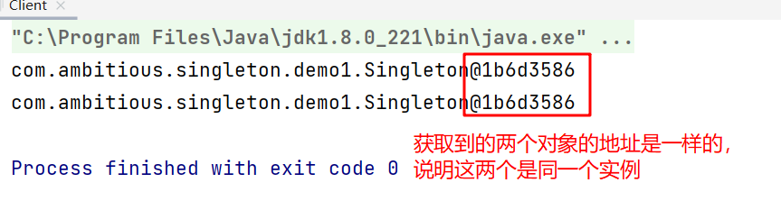
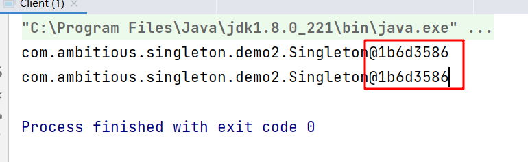
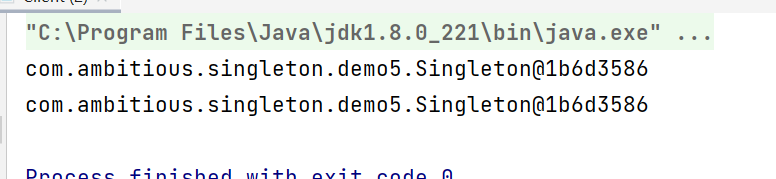
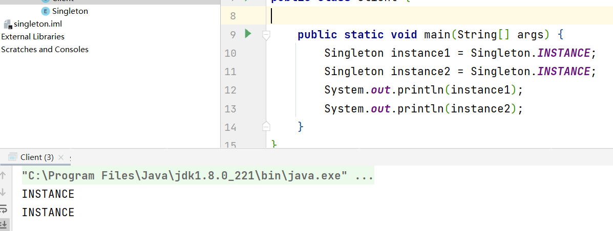
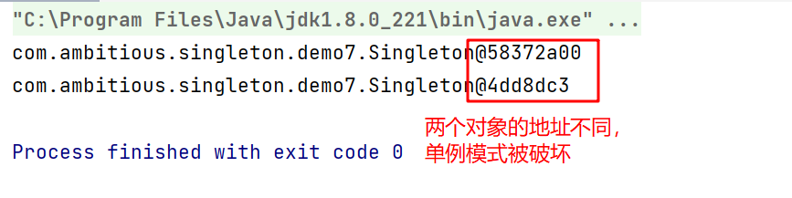
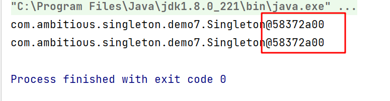

# 1 单例模式的结构
单例模式主要有以下角色：
- 单例类：只能创建一个实例的类
- 访问类：使用单例类
  
# 2 单例模式的实现
单例设计模式分类有两种：

## 2.1 饿汉式
**类加载**就会导致该单实例对象被创建
> 类加载完成之后该对象就会一直存在于内存之中，就会造成内存浪费。

### 2.1.1 静态成员变量方式
- 构造方法私有
- 定义一个静态的该类的成员变量，同时实例化
- 提供一个静态的公有的方法，供外界获取该类的实例

```java
public class Singleton {

    /**
     * 1 私有化构造方法
     */
    private Singleton() {}
    /**
     * 2 静态的私有的本类的成员变量，同时进行实例化
     */
    private static final Singleton INSTANCE = new Singleton();
    /**
     * 3 提供一个共有的获取静态成员变量的方法
     */
    public static Singleton getInstance() {
        return INSTANCE;
    }
}
```

```java
public static void main(String[] args) {
    // 获取两次Singleton类的实例并进行打印
    Singleton instance1 = Singleton.getInstance();
    Singleton instance2 = Singleton.getInstance();
    System.out.println(instance1);
    System.out.println(instance2);
}
```



### 2.1.2 静态代码块方式
- 构造方法私有
- 定义一个静态的该类的成员变量
- 在静态代码块中对该成员变量进行实例化
- 提供一个静态的公有的方法，供外界获取该类的实例

```java 
public class Singleton {

    /**
     * 1 私有化构造方法
     */
    private Singleton() {}
    /**
     * 2 定义私有的静态的成员变量
     */
    private static final Singleton INSTANCE;
    /**
     * 3 在静态代码块中实例化
     */
    static {
        INSTANCE = new Singleton();
    }
    /**
     * 4 提供公有的获取该成员变量的方法
     */
    public static Singleton getInstance() {
        return INSTANCE;
    }
}
```



## 2.2 懒汉式
类加载不会导致该单实例对象被创建，而是`首次使用该对象`时才会创建

### 2.2.1 线程不安全方式
在多线程的环境下，有概率出现两个线程同时进入到（instance == null）分支内，从而实例化出多个对象来。
- 构造方法私有
- 定义一个静态的该类的成员变量
- 提供一个静态的公有的方法，供外界获取该类的实例，第一次被获取时，实例化成员变量

```java
public class Singleton {

    private Singleton() {}
    
    private static Singleton instance;
    
    public static Singleton getInstance() {
        if(instance == null) {
            instance = new Singleton();
        }
        return instance;
    }
}
```

### 2.2.2 线程安全方式
在2.2.1的getInstance方法上添加synchronized关键字即可解决线程安全问题

### 2.2.3 双重检查锁方式
- 构造方法私有
- 定义一个静态的该类的成员变量，同时添加volatile关键字
  - 在多线程模式下，由于JVM的指令重排序，有可能会出现空指针异常
- 提供一个静态的公有的方法，供外界获取该类的实例，第一次被获取时进行双重检查锁，实例化成员变量

```java
public class Singleton {
    
    private Singleton() {}
    
    private static volatile Singleton instance;
    
    public static Singleton getInstance() {
        // 当instance不为null时，该方法为只读，不需要加锁
        if(instance == null) {
            synchronized (Singleton.class) {
                // 第二次判断instance是否为空
                if(instance == null) {
                    instance = new Singleton();
                }
            }
        }
        return instance;
    }
}
```

### 2.2.4 静态内部类
JVM在加载外部类的过程中不会加载静态内部类，只有内部类的属性/方法被调用时才会被加载。

- 构造方法私有
- 定义一个静态内部类，并在其中定义静态的外部类成员变量同时进行实例化
- 提供一个静态的公有的方法，供外界获取该类的实例

```java
public class Singleton {

    /**
     * 私有化构造方法
     */
    private Singleton() {}

    /**
     * 定义静态内部类
     */
    private static class SingletonHolder {
        // 直接定义并实例化外部类成员变量
        private static final Singleton INSTANCE = new Singleton();
    }
    
    public static Singleton getInstance() {
        return SingletonHolder.INSTANCE;
    }
}
```



### 2.2.5 枚举方式
在不想消耗内存空间的时候，可以使用枚举方式实现单例设计模式

```java 
public enum Singleton {
    /**
     * 单个实例
     */
    INSTANCE;
}
```



# 3 破坏单例模式

## 3.1 序列化和反序列化

- 使用Singleton类创建出一个对象，再将其写入到本地文件中
- 从本地文件中读取两次对象

```java
public class Client {

    public static final String PATH = "D:\\IDEA_Java\\design-pattern\\singleton\\src\\com\\ambitious\\singleton\\demo7\\a.txt";

    public static void main(String[] args) throws Exception {
        // writeObject2File();
        // 读取两次对象
        Singleton instance1 = (Singleton) readObjectFromFile();
        Singleton instance2 = (Singleton) readObjectFromFile();
        System.out.println(instance1);
        System.out.println(instance2);
    }

    /**
     * 将对象写入到本地文件中
     */
    public static void writeObject2File() throws Exception {
        // 创建对象输出流
        FileOutputStream fos = new FileOutputStream(PATH);
        ObjectOutputStream oos = new ObjectOutputStream(fos);
        // 获取对象
        Singleton instance = Singleton.getInstance();
        // 输出
        oos.writeObject(instance);
        // 关闭资源
        oos.close();
    }

    /**
     * 从文件中读取对象
     */
    public static Object readObjectFromFile() throws Exception {
        FileInputStream fis = new FileInputStream(PATH);
        ObjectInputStream ois = new ObjectInputStream(fis);
        return ois.readObject();
    }
}
```



**解决方法：**
在Singleton中添加方法readResolve，返回静态内部类的实例，反序列化时只要读取到该类存在这个方法，就不会重新去new对象。

```java
public Object readResolve() {
    return SingletonHolder.INSTANCE;
}
```



