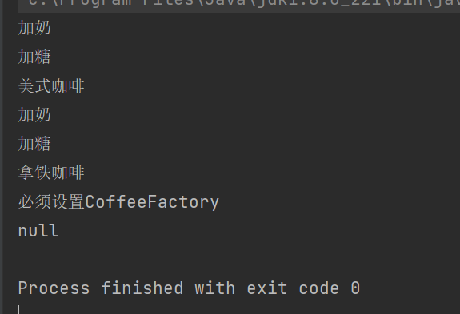

# 1 简单工厂
简单工厂不是一种设计模式，而是一种编程习惯
- 编写工厂类负责创建产品对象
- 其他地方需要用到产品对象时，从工厂类中获取即可
- 优点：将对象的创建和业务逻辑代码分隔开
- 缺点：要新增对象类型时，需要修改工厂的代码，违背了开闭原则。

咖啡工厂类：

```java
public class SimpleCoffeeFactory {

    public Coffee createCoffee(Coffee.Type type) {
        Coffee coffee = null;
        switch (type) {
            case LATTE:
                coffee = new LatteCoffee();
                break;
            case AMERICAN:
                coffee = new AmericanCoffee();
                break;
            default:
                break;
        }
        return coffee;
    }
}
```

咖啡商店类：
- 咖啡商店没有直接和具体产品进行接触，成功解耦合

```java
public class CoffeeStore {

    public Coffee orderCoffee(Coffee.Type type) {
        SimpleCoffeeFactory factory = new SimpleCoffeeFactory();
        Coffee coffee = factory.createCoffee(type);
        coffee.addMilk();
        coffee.addSugar();
        return coffee;
    }
}
```

# 2 工厂方法模式
描述：工厂方法模式可以完美解决简单工厂的缺点，完全遵循开闭原则。
概念：定义一个用于创建对象的接口，让子类决定实例化哪个产品类对象。工厂方法使一个产品类的实例化延迟到其工厂的子类。

## 2.1 设计方式
- 定义CoffeeFactory接口，携带方法createCoffee

```java
public interface CoffeeFactory {

    /**
     * 生产咖啡，具体咖啡由实现类决定
     * @return 抽象咖啡
     */
    Coffee createCoffee();
}
```

- 创建CoffeeFactory实现类，重写createCoffee方法

```java
public class AmericanCoffeeFactory implements CoffeeFactory{

    @Override
    public Coffee createCoffee() {
        return new AmericanCoffee();
    }
}
```

```java
public class LatteCoffeeFactory implements CoffeeFactory{

    @Override
    public Coffee createCoffee() {
        return new LatteCoffee();
    }
}
```

- 商店定义CoffeeFactory属性，具体实现由外部决定

```java
public class CoffeeStore1 {

    private CoffeeFactory factory;

    public CoffeeStore1() {}

    public CoffeeStore1(CoffeeFactory factory) {
        this.factory = factory;
    }

    public void setFactory(CoffeeFactory factory) {
        this.factory = factory;
    }

    public Coffee orderCoffee() {
        Coffee coffee = null;
        if(this.factory == null) {
            // 对象没有设置咖啡工厂
            System.out.println("必须设置CoffeeFactory");
        }else {
            coffee = factory.createCoffee();
            coffee.addMilk();
            coffee.addSugar();
        }
        return coffee;
    }
}
```

- 客户端根据不同工厂获取Coffee实例

```java
public static void useFactoryMethod() {
    CoffeeStore1 store = new CoffeeStore1(new AmericanCoffeeFactory());
    Coffee coffee = store.orderCoffee();
    System.out.println(coffee.getName());
    store.setFactory(new LatteCoffeeFactory());
    Coffee coffee2 = store.orderCoffee();
    System.out.println(coffee2.getName());
    store.setFactory(null);
    Coffee coffee1 = store.orderCoffee();
    System.out.println(coffee1);
}
```



# 3 抽象工厂模式
抽象工厂是一种为访问类提供一个创建一组相关或相互依赖对象的接口，且访问类无须指定索要产品的具体类就能得到同族的不同等级的产品的模式结构。
抽象工厂模式是工厂方法模式的升级版本，工厂方法模式只生产一个等级的产品，而抽象工厂模式可生产多个等级的产品。

## 3.1 设计流程
- 抽象食品工厂FoodFactory， 可生产咖啡（createCoffee）和甜品（createDessert）

```java
public interface FoodFactory {

    /**
     * 生产咖啡
     * @return 抽象咖啡
     */
    Coffee createCoffee();

    /**
     * 生产甜品
     * @return 抽象甜品
     */
    Dessert createDessert();
}
```

- 美式食品工厂（AmericanFoodFactory）和意大利食品工厂（ItalyFoodFactory）

```java
public class AmericanFoodFactory implements FoodFactory {

    @Override
    public Coffee createCoffee() {
        // 生产美式咖啡
        return new AmericanCoffee();
    }

    @Override
    public Dessert createDessert() {
        // 生产抹茶慕斯
        return new MatchaMousse();
    }
}
```

```java
public class ItalyFoodFactory implements FoodFactory {

    @Override
    public Coffee createCoffee() {
        // 生产拿铁咖啡
        return new LatteCoffee();
    }

    @Override
    public Dessert createDessert() {
        // 生产提拉米苏
        return new Tiramisu();
    }
}
```

- 使用工厂来获得产品对象

```java
public static void main(String[] args) {
    FoodFactory factory;
    // 美式食品
    factory = new AmericanFoodFactory();
    Coffee coffee = factory.createCoffee();
    Dessert dessert = factory.createDessert();
    System.out.println(coffee.getName());
    System.out.println(dessert.getName());
    // 意大利食品
    factory = new ItalyFoodFactory();
    Dessert dessert1 = factory.createDessert();
    Coffee coffee1 = factory.createCoffee();
    System.out.println(coffee1.getName());
    System.out.println(dessert1.getName());
}
```


