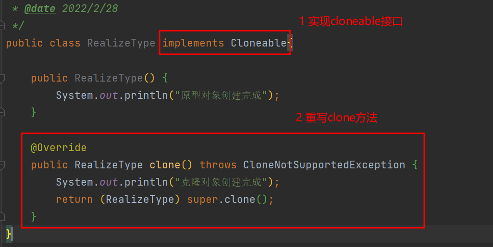
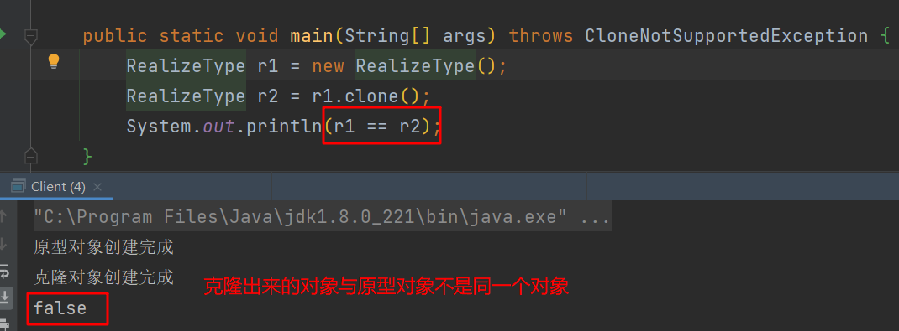
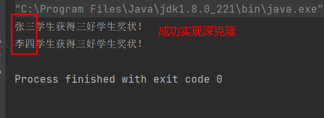

> 原型模式包含如下角色：
> - 抽象原型类：规定了具体原型对象必须实现的clone()方法
> - 具体原型类：实现抽象原型类的clone()方法，它是可被复制的对象
> - 访问类：使用具体原型类中的clone()方法来复制新的对象

# 1 浅克隆



# 2 深克隆
使用对象的序列化与反序列化实现深克隆

```java
public class Student implements Serializable {

    private String name;

    public String getName() {
        return name;
    }

    public void setName(String name) {
        this.name = name;
    }
}
```

```java
public class Certificate implements Serializable {

    private Student student;

    public Student getStudent() {
        return student;
    }

    public void setStudent(Student student) {
        this.student = student;
    }

    public void show() {
        System.out.println(student.getName() + "学生获得三好学生奖状！");
    }
}
```

```java
public class Client {

    public static final String PATH = "D:\\IDEA_Java\\design-pattern\\prototype\\src\\main\\java\\com\\ambitious\\prototype\\demo2\\a.txt";

    public static void main(String[] args) throws IOException, ClassNotFoundException {
        // 原型对象
        Certificate certificate = new Certificate();
        Student stu = new Student();
        stu.setName("张三");
        certificate.setStudent(stu);
        // 使用序列化与反序列化深克隆对象
        writeObject(certificate);
        Certificate certificate1 = readObject();
        certificate1.getStudent().setName("李四");
        // 输出
        certificate.show();
        certificate1.show();
    }

    private static Certificate readObject() throws IOException, ClassNotFoundException {
        ObjectInputStream ois = new ObjectInputStream(new FileInputStream(PATH));
        Object o = ois.readObject();
        return (Certificate) o;
    }

    private static void writeObject(Certificate certificate) throws IOException {
        ObjectOutputStream oos = new ObjectOutputStream(new FileOutputStream(PATH));
        oos.writeObject(certificate);
        oos.close();
    }
}
```



