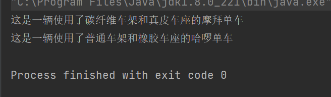
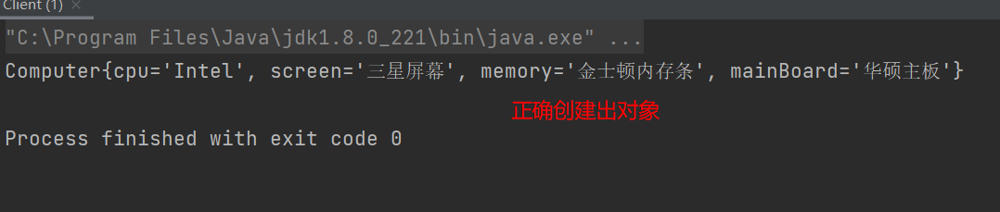

# 1 概述
将一个复杂对象的构建与表示分离，使得同样的构建过程可以创建不同的表示。

# 2 角色
- 抽象建造者类（Builder）：这个接口规定要实现复杂对象的那些部分的创建，不涉及具体的对象部件的创建
- 具体建造者类（ConcreteBuilder）：实现Builder接口，完成复杂产品的各个部件的具体创建方法。在构造方法完成后，提供产品的实例
- 产品类（Product）：要创建的复杂对象
- 指挥者类（Director）：调用具体的创造者来创建复杂对象的各个部分，在指导者中不涉及具体产品的信息，只负责保证对象各部分完整创建或按某种顺序创建

# 3 案例：生产自行车

```java
public class Bike {

    private String frame;
    private String seat;
    private String name;

    public String getName() {
        return name;
    }

    public void setName(String name) {
        this.name = name;
    }

    public String getFrame() {
        return frame;
    }

    public void setFrame(String frame) {
        this.frame = frame;
    }

    public String getSeat() {
        return seat;
    }

    public void setSeat(String seat) {
        this.seat = seat;
    }

    @Override
    public String toString() {
        return "这是一辆使用了" + this.frame + "和" + this.seat + "的" + this.name;
    }
}
```

```java
public abstract class BikeBuilder {

    protected final Bike bike = new Bike();

    /**
     * 建造车架
     */
    public abstract BikeBuilder buildFrame();

    /**
     * 建造车座
     */
    public abstract BikeBuilder buildSeat();

    /**
     * 构建单车
     * @return 单车对象
     */
    public abstract Bike build();
}
```

```java
public class HelloBikeBuilder extends BikeBuilder{

    @Override
    public BikeBuilder buildFrame() {
        bike.setFrame("普通车架");
        return this;
    }

    @Override
    public BikeBuilder buildSeat() {
        bike.setSeat("橡胶车座");
        return this;
    }

    @Override
    public Bike build() {
        bike.setName("哈啰单车");
        return bike;
    }
}
```

```java
public class MobileBikeBuilder extends BikeBuilder{

    @Override
    public BikeBuilder buildFrame() {
        bike.setFrame("碳纤维车架");
        return this;
    }

    @Override
    public BikeBuilder buildSeat() {
        bike.setSeat("真皮车座");
        return this;
    }

    @Override
    public Bike build() {
        bike.setName("摩拜单车");
        return bike;
    }
}
```

```java
public class BikeDirector {

    private final BikeBuilder builder;

    public BikeDirector(BikeBuilder builder) {
        this.builder = builder;
    }

    public Bike construct() {
        return builder.buildFrame()
                .buildSeat()
                .build();
    }
}
```

在客户端调用方中无须关注单车的生产细节

```java
public class Client {

    public static void main(String[] args) {
        BikeDirector director1 = new BikeDirector(new MobileBikeBuilder());
        Bike bike1 = director1.construct();
        BikeDirector director2 = new BikeDirector(new HelloBikeBuilder());
        Bike bike2 = director2.construct();
        System.out.println(bike1);
        System.out.println(bike2);
    }
}
```



# 4 建造者模式扩展
建造者模式除了上面的用途外，在开发中还有一个常用的使用方式，就是`当一个类构造器需要传入很多参数时，如果创建这个类的实例，代码可读性会非常差，而且很容易引入错误`，此时就可以利用建造者模式进行重构。

> 思路：
> 1. 将需要使用建造者模式构建的类的构造方法私有化，并且参数为Builder类型
> 2. 在其内部定义一个静态内部类（Builder）
> 3. 在内部类中定义与外部类相同的属性
> 4. 为每一个属性提供赋值方法，返回值为自身（Builder）
> 5. 最后再提供一个build方法，返回值为外部类

代码实现：
```java
public class Computer {

    private String cpu;
    private String screen;
    private String memory;
    private String mainBoard;

    private Computer(Builder builder) {
        this.cpu = builder.cpu;
        this.screen = builder.screen;
        this.memory = builder.memory;
        this.mainBoard = builder.mainBoard;
    }

    @Override
    public String toString() {
        return "Computer{" +
                "cpu='" + cpu + '\'' +
                ", screen='" + screen + '\'' +
                ", memory='" + memory + '\'' +
                ", mainBoard='" + mainBoard + '\'' +
                '}';
    }

    public static final class Builder {
        private String cpu;
        private String screen;
        private String memory;
        private String mainBoard;

        public Builder cpu(String cpu) {
            this.cpu = cpu;
            return this;
        }

        public Builder screen(String screen) {
            this.screen = screen;
            return this;
        }

        public Builder memory(String memory) {
            this.memory = memory;
            return this;
        }

        public Builder mainBoard(String mainBoard) {
            this.mainBoard = mainBoard;
            return this;
        }

        public Computer build() {
            return new Computer(this);
        }
    }
}
```

在外部使用Builder对象构建Computer对象：

```java
public static void main(String[] args) {
        Computer computer = new Computer.Builder()
                .cpu("Intel")
                .screen("三星屏幕")
                .memory("金士顿内存条")
                .mainBoard("华硕主板")
                .build();
        System.out.println(computer);
    }
```



# 5 建造者模式与其他模式的区别

## 5.1 与工厂方法模式的区别
- 工厂方法模式注重`整体对象的创建方式`
- 建造者模式注重`部件构建的过程`

## 5.2 与抽象工厂模式的区别
- 抽象工厂模式注重`一个产品族中配件的生产`
- 建造者模式注重`怎么通过配件组装得到一个完整的产品`

