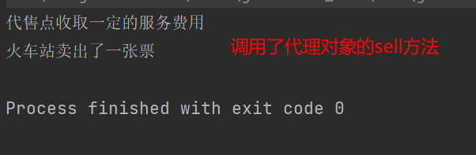
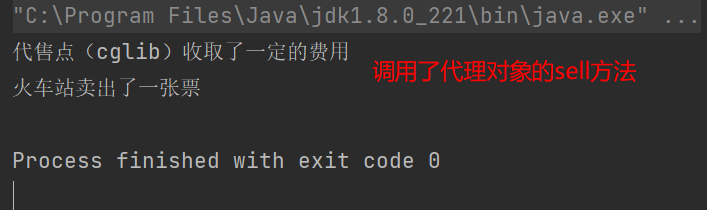

## 1. 概述
由于某些原因需要给某对象提供一个代理以控制该对象的访问。这时，访问对象不适合或者不能直接引用目标对象，代理对象作为访问对象和目标对象之间的中介。

Java中的代理按照代理类生成实际不同又分为**静态代理**和**动态代理**。静态代理代理类在编译器就生成，而动态代理代理类则是在Java运行时动态生成。动态代理又有**JDK代理**和**CGLib**代理两种。

## 2. 结构
代理模式分为三种角色：
- 抽象主题类：通过接口或抽象类声明真实主题和代理对象实现的业务方法
- 真实主题类：实现了抽象主题中的具体业务，是代理对象所代表的真实对象，是最终要引用的对象
- 代理类：提供了与真实主题相同的接口，其内部含有对真实主题的引用，它可以访问、控制或扩展真实主题的功能。

## 3. 静态代理 —— 火车站代理售票

抽象主题类（规定售票需要实现的方法）：
```java
public interface SellTickets {

    /**
     * 售票需要实现的方法
     */
    void sell();
}
```

具体主题类（火车站实现售票方法）：
```java
public class TrainStation implements SellTickets {

    @Override
    public void sell() {
        System.out.println("火车站卖出了一张票");
    }
}
```

代理类（代理火车站进行售票）：
```java
public class ProxyPoint implements SellTickets {

    private TrainStation trainStation = new TrainStation();

    @Override
    public void sell() {
        // 代理类可以对原有方法进行增强
        System.out.println("代理点收取了一点费用");
        trainStation.sell();
    }
}
```

客户端（用户直接在代理点进行买票）：
```java
public static void main(String[] args) {
    ProxyPoint proxy = new ProxyPoint();
    proxy.sell();
}
```


## 4. JDK动态代理
创建一个代理工厂类，在其中定义好代理对象方法的增强逻辑，在客户端中无需与代理类直接接触，只需要调用代理工厂对象的方法即可得到代理类。

**代理工厂类代码**：
- Proxy.newProxyInstance方法的三个参数：
  - 1. 代理类的类加载器
  - 2. 代理类实现的接口（数组）
  - 3. 代理对象的方法增强

```java
public class ProxyFactory {

    /**
     * 代理类对象
     */
    private TrainStation station = new TrainStation();

    /**
     * 在这个方法中创建出station对象的代理对象
     * @return 代理对象
     */
    public SellTickets getProxyObject() {
        return (SellTickets) Proxy.newProxyInstance(
                station.getClass().getClassLoader(),
                station.getClass().getInterfaces(),
                new InvocationHandler() {
                    @Override
                    public Object invoke(Object proxy, Method method, Object[] args) throws Throwable {
                        // 代理对象中的方法被调用时会执行这个方法
                        System.out.println("代售点收取一定的服务费用");
                        return method.invoke(station, args);
                    }
                }
        );
    }
}
```



## 5. CGLib动态代理
cglib是一个功能强大，高性能的代码生成包，它为没有实现接口的类提供代理，为JDK的动态代理提供了很好的补充。

cglib是第三方提供的包，坐标如下：
```xml
<dependency>
    <groupId>cglib</groupId>
    <artifactId>cglib</artifactId>
    <version>2.2.2</version>
</dependency>
```

代理工厂类代码：
- 实现MethodInterceptor接口，重写intercept方法，这个方法与jdk代理中InvocationHandler的invoke方法是一致的。
- 给定获取代理类对象的方法
```java
public class ProxyFactory implements MethodInterceptor {

    private TrainStation station = new TrainStation();

    @Override
    public Object intercept(Object o, Method method, Object[] objects, MethodProxy methodProxy) throws Throwable {
        System.out.println("代售点（cglib）收取了一定的费用");
        return method.invoke(station, objects);
    }

    public TrainStation getProxyStation() {
        // 1 创建用于增强的Enhancer对象
        Enhancer enhancer = new Enhancer();
        // 2 指定代理类的父类字节码
        enhancer.setSuperclass(TrainStation.class);
        // 3 设置回调，即实现了MethodInterceptor接口的对象
        enhancer.setCallback(this);
        // 4 创建代理
        return (TrainStation) enhancer.create();
    }
}
```



## 6. 动态代理和静态代理的区别
> 1. 动态代理和静态代理相比较，最大的好处是接口中声明的所有方法都**被转移到调用处理器一个集中的方法处理**。
> 2. 如果接口增加一个方法，静态代理模式除了所有实现类需要实现这个方法外，**所有代理类也需要实现此方法**。增加了代码维护的复杂度，而动态代理不会出现该问题。

## 7. 使用场景
- 远程代理（RPC）
- 防火墙代理（VPN）
- 保护代理