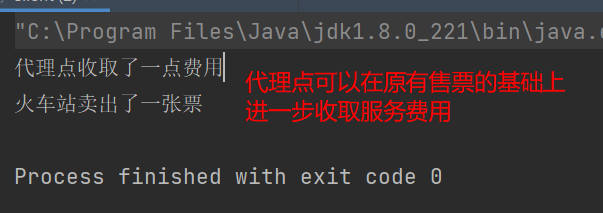

## 1 概述
由于某些原因需要给某对象提供一个代理以控制该对象的访问。这时，访问对象不适合或者不能直接引用目标对象，代理对象作为访问对象和目标对象之间的中介。

Java中的代理按照代理类生成实际不同又分为**静态代理**和**动态代理**。静态代理代理类在编译器就生成，而动态代理代理类则是在Java运行时动态生成。动态代理又有**JDK代理**和**CGLib**代理两种。

## 2 结构
代理模式分为三种角色：
- 抽象主题类：通过接口或抽象类声明真实主题和代理对象实现的业务方法
- 真实主题类：实现了抽象主题中的具体业务，是代理对象所代表的真实对象，是最终要引用的对象
- 代理类：提供了与真实主题相同的接口，其内部含有对真实主题的引用，它可以访问、控制或扩展真实主题的功能。

## 3 静态代理 —— 火车站代理售票

抽象主题类（规定售票需要实现的方法）：
```java
public interface SellTickets {

    /**
     * 售票需要实现的方法
     */
    void sell();
}
```

具体主题类（火车站实现售票方法）：
```java
public class TrainStation implements SellTickets {

    @Override
    public void sell() {
        System.out.println("火车站卖出了一张票");
    }
}
```

代理类（代理火车站进行售票）：
```java
public class ProxyPoint implements SellTickets {

    private TrainStation trainStation = new TrainStation();

    @Override
    public void sell() {
        // 代理类可以对原有方法进行增强
        System.out.println("代理点收取了一点费用");
        trainStation.sell();
    }
}
```

客户端（用户直接在代理点进行买票）：
```java
public static void main(String[] args) {
    ProxyPoint proxy = new ProxyPoint();
    proxy.sell();
}
```



