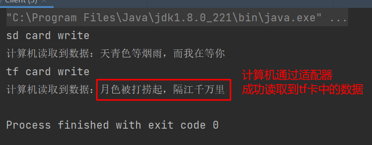
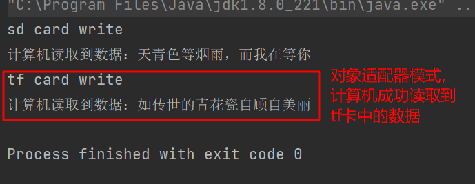

## 1. 概述
将一个类的接口转换成客户希望的另外一个接口，使得原本由于接口不兼容而不能一起工作的那些类能一起工作。

适配器模式分为`类适配器`和`对象适配器`模式，前者类之间的耦合度比后者高，且要求程序员了解现有组件库中的相关组件的内部结构，所以应用相对较少。

## 2. 角色
适配器模式（Adapter）包含以下主要角色：
- 目标（Target）接口：当前系统业务所期待的接口，它可以是抽象类或接口。
- 适配者（Adaptee）类：它是被访问和适配的现存组件库中的组件接口。
- 适配器（Adapter）类：它是一个转换器，通过继承或引用适配者对象，把适配者接口转换成目标接口，让客户按目标接口的格式访问适配者。

## 3. 类适配器
类适配器模式违背了`合成复用原则`，客户类有接口规范时可用，反之不可用。

**案例：计算机读取内存卡数据**
> 计算机可以读取sd卡中的数据，而不能读取tf卡中的数据，而sd卡有自己的接口规范，故可以定义一个适配器，将tf卡的读取与sd卡进行适配，这样就可以在计算机中读取tf卡的数据了

- 内存卡接口（Card）
```java
public interface Card {

    /**
     * 往卡中写入数据
     * @param msg 数据
     */
    void write(String msg);

    /**
     * 读取数据
     * @return 卡中存放的数据
     */
    String read();
}
```

- sd卡接口（SDCard）
```java
public interface SDCard extends Card {

    /**
     * 往sd卡中写入数据
     * @param msg 数据
     */
    @Override
    void write(String msg);

    /**
     * 读取数据
     * @return sd卡中存放的数据
     */
    @Override
    String read();
}
```

- tf卡接口（TFCard）
```java
public interface TFCard extends Card {

    /**
     * 写入数据到tf卡
     * @param msg 数据
     */
    @Override
    void write(String msg);

    /**
     * 读取tf卡中的数据
     * @return 数据
     */
    @Override
    String read();
}
```

- sd卡实现类（SDCardImpl）
```java
public class SDCardImpl implements SDCard{

    private String msg;

    @Override
    public void write(String msg) {
        this.msg = msg;
        System.out.println("sd card write");
    }

    @Override
    public String read() {
        return this.msg;
    }
}
```

- tf卡实现类（TFCardImpl）
```java
public class TFCardImpl implements TFCard{

    private String msg;

    @Override
    public void write(String msg) {
        this.msg = msg;
        System.out.println("tf card write");
    }

    @Override
    public String read() {
        return this.msg;
    }
}
```

- 计算机类（Computer）
```java
public class Computer {

    public void readSd(SDCard sdCard) {
        String memory = sdCard.read();
        System.out.println("计算机读取到数据：" + memory);
    }
}
```

- 客户端类（Client）
```java
public class Client {

    public static void main(String[] args) {
        Computer computer = new Computer();
        // 计算机可以直接读取sd卡中的数据
        SDCardImpl sdCard = new SDCardImpl();
        sdCard.write("天青色等烟雨，而我在等你");
        computer.readSd(sdCard);
        // 使用适配器读取tf卡中的数据
        SDAdapterTF adapter = new SDAdapterTF();
        adapter.write("月色被打捞起，隔江千万里");
        computer.readSd(adapter);
    }
}
```



## 4. 对象适配器
对象适配器解决了类适配器的缺点，符合合成复用原则，且当客户类没有提供接口规范时，适配器可以直接继承客户类。

仍然是计算机读取内存案例
适配器类：
- 与类适配器的区别是，该适配器将tf卡聚合到自身中，而不是直接继承，更符合实际。
```java
public class SDAdapterTF implements SDCard{

    private TFCard tfCard;

    public SDAdapterTF(TFCard tfCard) {
        this.tfCard = tfCard;
    }

    @Override
    public String read() {
        return this.tfCard.read();
    }

    @Override
    public void write(String msg) {
        this.tfCard.write(msg);
    }
}
```

客户端调用时，只需要把tf卡对象“托付”给适配器对象即可被计算机正常读取：
```java
public static void main(String[] args) {
    Computer computer = new Computer();
    // 计算机可以直接读取sd卡中的数据
    SDCardImpl sdCard = new SDCardImpl();
    sdCard.write("天青色等烟雨，而我在等你");
    computer.readSd(sdCard);
    // 使用适配器读取tf卡中的数据
    TFCardImpl tfCard = new TFCardImpl();
    tfCard.write("如传世的青花瓷自顾自美丽");
    SDAdapterTF adapter = new SDAdapterTF(tfCard);
    computer.readSd(adapter);
}
```



