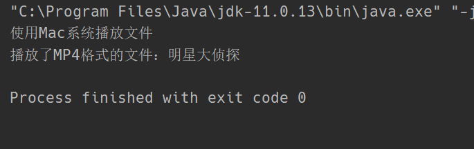

# 桥接模式

## 1. 概述

在一个有多种可能会变化的维度的系统中，用继承方式会造成类爆炸，扩展起来不灵活。每次在一个维度上新增一个具体实现都要增加多个子类。为了更灵活地设计系统，我们此时可以考虑使用桥接模式。

桥接模式将抽象与实现分离，使它们可以独立变化。它是用**组合关系代替继承关系**来实现，从而降低了抽象和实现这两个可变维度的耦合度。

## 2. 结构

桥接模式包含以下主要角色：

- 抽象化（Abstraction）角色：定义抽象类，并包含一个对实现化对象的引用。
- 扩展抽象化（Refined Abstraction）角色：是抽象化角色的子类，实现父类中的业务方法，并通过组合关系调用实现化角色中的业务方法。
- 实现化（Implementor）角色：定义实现化角色的接口，供扩展抽象化角色调用。
- 具体实现化（Concrete Implementor）角色：给出实现化角色接口的具体实现。

## 3. 案例 视频播放器

编写一个视频播放器，可以在不同的操作系统环境（Windows、Linux、Mac）下，播放不同格式的视频文件（MP4、AVI）。这个需求中涉及到了两个不同的维度，适合使用桥接模式来进行编写。

**创建实现化角色**

视频文件接口，定义视频解码方法

```java
public interface VideoFile {

    /**
     * 视频解码
     * @param fileName 文件名称
     */
    void decode(String fileName);
}
```

**创建具体实现化角色**

具体的视频文件类（MP4、AVI），实现视频解码方法

```java
public class Mp4File implements VideoFile{

    @Override
    public void decode(String fileName) {
        System.out.println("播放了MP4格式的文件：" + fileName);
    }
}
```

```java
public class AviFile implements VideoFile{

    @Override
    public void decode(String fileName) {
        System.out.println("播放了avi格式的视频：" + fileName);
    }
}
```

**创建抽象化角色**

操作系统抽象类，聚合了视频文件属性，可以播放不同格式的视频文件

```java
public abstract class OperatingSystem {

    protected VideoFile videoFile;

    public OperatingSystem(VideoFile videoFile) {
        this.videoFile = videoFile;
    }

    /**
     * 操作系统播放视频文件
     * @param fileName 文件名称
     */
    public abstract void play(String fileName);
}

```

**创建具体抽象化角色**

具体的操作系统类（Windows、Mac），实现不同系统播放不同格式的视频文件

```java
public class Windows extends OperatingSystem{

    public Windows(VideoFile videoFile) {
        super(videoFile);
    }

    @Override
    public void play(String fileName) {
        System.out.println("使用windows操作系统播放文件");
        videoFile.decode(fileName);
    }
}
```

```java
public class Mac extends OperatingSystem{

    public Mac(VideoFile videoFile) {
        super(videoFile);
    }

    @Override
    public void play(String fileName) {
        System.out.println("使用Mac系统播放文件");
        videoFile.decode(fileName);
    }
}
```

**主方法调用**

```java
public class Client {

    public static void main(String[] args) {
        // 在mac上尝试播放MP4文件
        OperatingSystem os = new Mac(new Mp4File());
        os.play("明星大侦探");
    }
}
```



## 4. 桥接模式的好处

- 桥接模式提高了系统的可扩充性，在两个变化维度中任意扩展一个维度，都不需要修改原有系统。
- 实现细节对客户透明。

