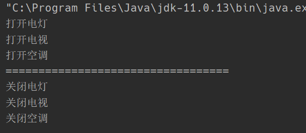

# 外观模式

## 1. 概述

外观模式（Facade）又名门面模式，是一种通过为多个复杂的子系统提供一个一致的接口，而使这些子系统更加容易被访问的模式。该模式对外有一个统一接口，外部应用程序不用关心内部子系统的具体细节，这样会大大降低应用程序的复杂度，提高了程序的可维护性。基金就是一个典型的外观模式，用户可以通过购买基金来间接操作股票、债券，而不需要知道内部的具体运作细节。

外观模式是"迪米特法则"的典型应用

## 2. 结构

外观（Facade）模式包含以下角色：

- 外观（Facade）角色：为多个子系统对外提供一个共同的接口。
- 子系统（Sub System）角色：实现系统的部分功能，客户可以通过外观角色访问它。

### 3. 案例 智能音箱

智能音箱可以通过语音控制的方式自动帮我们打开各种家电（电灯、电视机、空调），用户只需要与智能音箱进行交互便可以间接操作家电，所以智能家电符合外观设计模式。

**家电类**

```java
public class Light {

    public void on() {
        System.out.println("打开电灯");
    }

    public void off() {
        System.out.println("关闭电灯");
    }
}
```

```java
public class TV {

    public void on() {
        System.out.println("打开电视");
    }

    public void off() {
        System.out.println("关闭电视");
    }
}
```

```java
public class AirConditional {

    public void on() {
        System.out.println("打开空调");
    }

    public void off() {
        System.out.println("关闭空调");
    }
}
```

**智能音箱类**

智能音箱聚合了家电类，对外接收语音消息，识别出结果之后自动执行相关的操作

```java
public class SmartAppliancesFacade {

    private Light light;
    private TV tv;
    private AirConditional airConditional;

    public SmartAppliancesFacade() {
        this.light = new Light();
        this.tv = new TV();
        this.airConditional = new AirConditional();
    }

    public void say(String message) {
        if(message.contains("打开")) {
            on();
        }else if(message.contains("关闭")) {
            off();
        }else {
            System.out.println("我好像听不懂你在说啥哦");
        }
    }

    private void on()  {
        light.on();
        tv.on();
        airConditional.on();
    }

    private void off() {
        light.off();
        tv.off();
        airConditional.off();
    }
}
```

**测试**

```java
public class Client {

    public static void main(String[] args) {
        SmartAppliancesFacade facade = new SmartAppliancesFacade();
        facade.say("打开家电");
        System.out.println("==================================");
        facade.say("关闭家电");
    }
}
```




