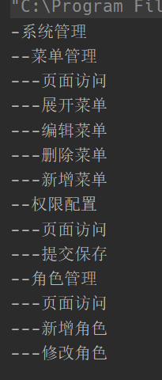

# 组合模式

## 1. 概念

组合模式又名部分整体模式，是用于把一组相似的对象当作一个单一的对象。组合模式依据树形结构来组合对象，用来表示部分以及整体层次。这种类型的设计模式属于结构型模式，它创建了对象组的树形结构。

## 2. 结构

组合模式主要包含三种角色：

- 抽象根结点（Component）：定义系统各层次对象的公有方法和属性，可以预先定义一些默认行为和属性。
- 树枝节点（Composite）：定义树枝节点的行为，存储子节点，组合树枝节点和叶子结点形成一个树形结构。
- 叶子结点（leaf）：叶子结点对象，其下再无分支，是系统层次遍历的最小单位。

## 3.案例 软件菜单

使用树形结构模拟软件菜单，需要定义一个公共的菜单组件类，描述菜单和菜单项公共的属性（名称，层级）

**菜单组件类**

```java
public abstract class MenuComponent {

    /**
     * 结点名称
     */
    protected String name;
    /**
     * 结点层级
     */
    protected Integer level;

    /**
     * 添加结点
     * 只有菜单结点可以添加子结点，所以在父类中默认抛出异常，以下同理
     */
    public void add(MenuComponent component) {
        throw new UnsupportedOperationException();
    }

    /**
     * 删除结点
     */
    public void delete(MenuComponent component) {
        throw new UnsupportedOperationException();
    }

    /**
     * 获取结点
     */
    public MenuComponent getComponent(int index) {
        throw new UnsupportedOperationException();
    }

    /**
     * 获取结点名称
     */
    public String getName() {
        return this.name;
    }

    /**
     * 打印结点
     */
    public void print() {
        // 输出自身
        for(int i = 0; i < this.level; ++i) {
            System.out.print("-");
        }
        System.out.println(this.name);
    }
}
```

**菜单类**

继承菜单组件类，并且聚合菜单组件类

```java
public class Menu extends MenuComponent{

    /**
     * 子结点列表集合
     */
    private final List<MenuComponent> components = new ArrayList<>();

    public Menu(String name) {
        this.name = name;
    }

    public Menu(String name, int level) {
        this.name = name;
        this.level = level;
    }

    @Override
    public void add(MenuComponent component) {
        this.components.add(component);
        // 将组件设置为下级结点
        component.level = this.level + 1;
    }

    @Override
    public void delete(MenuComponent component) {
        this.components.remove(component);
    }

    @Override
    public MenuComponent getComponent(int index) {
        return this.components.get(index);
    }

    @Override
    public void print() {
        super.print();
        // 遍历子结点进行输出
        for (MenuComponent component : this.components) {
            component.print();
        }
    }
}
```

**菜单项类**

```java
public class MenuItem extends MenuComponent{

    public MenuItem(String name) {
        this.name = name;
    }

    public MenuItem(String name, int level) {
        this.name = name;
        this.level = level;
    }
}
```

**测试**

```java
public class Client {

    public static void main(String[] args) {
        // 构建菜单树
        MenuComponent menu = new Menu("系统管理", 1);
        // 2级菜单
        MenuComponent menu1 = new Menu("菜单管理");
        MenuComponent menu2 = new Menu("权限配置");
        MenuComponent menu3 = new Menu("角色管理");
        menu.add(menu1);
        menu.add(menu2);
        menu.add(menu3);
        // 3级菜单
        menu1.add(new MenuItem("页面访问"));
        menu1.add(new MenuItem("展开菜单"));
        menu1.add(new MenuItem("编辑菜单"));
        menu1.add(new MenuItem("删除菜单"));
        menu1.add(new MenuItem("新增菜单"));

        menu2.add(new MenuItem("页面访问"));
        menu2.add(new MenuItem("提交保存"));

        menu3.add(new MenuItem("页面访问"));
        menu3.add(new MenuItem("新增角色"));
        menu3.add(new MenuItem("修改角色"));
        // 打印
        menu.print();
    }
}
```




