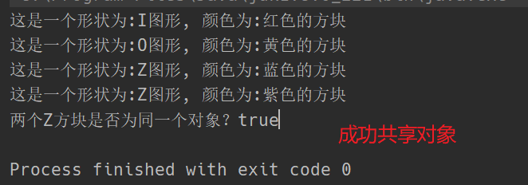

# 享元模式

## 1. 概述

享元模式是运用共享技术来有效地支持大量细粒度对象的复用。它通过共享已经存在的对象来大幅度减少需要创建的对象数量，避免大量相似对象的开销，从而提高系统资源的利用率。

## 2. 结构

享元（Flyweight）模式中存在以下两种状态：

- 内部状态：不会随着外界环境的改变而改变的可共享部分
- 外部状态：随环境改变而改变的不可以共享的部分。享元模式的实现要领就是区分应用中的这两种状态，并将外部状态外部化。

享元模式有以下角色：

- 抽象享元角色（Flyweight）：通常是一个接口或者抽象类，在抽象享元类中声明了具体享元类的公共的方法，这些方法可以向外界提供享元对象的内部数据（内部状态），同时也可以通过这些方法来设置外部数据（外部状态）。
- 具体享元角色（Concrete Flyweight）：它实现了抽象享元类，称为享元对象；在具体享元类中为内部状态提供了存储空间。通常我们可以结合单例模式来设计具体享元类，为每一个具体享元类提供唯一的享元对象。
- 非享元角色（Unsharable Flyweight）：并不是所有的抽象享元类的子类都需要被共享，不能被共享的子类可设计为非共享具体享元类；当需要一个非共享具体享元类对象时可以直接通过实例化创建。
- 享元工厂角色（Flyweight Factory）：负责创建和管理享元角色。当客户对象请求一个享元对象时，享元工厂检查系统中是否存在符合要求的享元对象，如果存在则提供给用户；如果不存在的话，则创建一个新的享元对象。

## 3. 案例 俄罗斯方块

在俄罗斯方块这个游戏中，一局游戏会出现很多次形状相同，但颜色不同的方块，在设计游戏的时候，如果一个方块就创建一个对象，那么无疑是非常浪费内存空间的一种行为。这时候就可以使用到享元模式，同一种形状的方块共享一个对象，方块的形状就是内部状态，而方块的颜色就是外部状态。

**方块类 —— 抽象享元角色**

```java
public abstract class Box {

    /**
     * 获取方块的形状
     */
    public abstract String getShape();

    public void display(String color) {
        System.out.println("这是一个形状为:" + getShape() + ", 颜色为:" + color + "的方块");
    }
}
```

**具体方块类 —— 具体享元角色**

```java
public class IBox extends Box{

    @Override
    public String getShape() {
        return "I图形";
    }
}
```

```java
public class OBox extends Box{

    @Override
    public String getShape() {
        return "O图形";
    }
}
```

```java
public class ZBox extends Box{

    @Override
    public String getShape() {
        return "Z图形";
    }
}
```

**方块工厂类 —— 享元工厂角色**

工厂使用单例设计模式，在工厂对象被创建的时候就直接为每一种形状的方块类型实例化一个对象，并存储起来。外部只需从工厂中获取即可。

```java
public class BoxFactory {

    /**
     * 存放共享对象
     */
    private final Map<String, Box> map;
    /**
     * 工厂单例对象
     */
    private static volatile BoxFactory instance;

    private BoxFactory() {
        this.map = new HashMap<>(16);
        map.put("I", new IBox());
        map.put("O", new OBox());
        map.put("Z", new ZBox());
    }

    /**
     * 使用双重检查锁的方式获取单例
     */
    public static BoxFactory getInstance() {
        if(instance == null) {
            synchronized (BoxFactory.class) {
                if(instance == null) {
                    instance = new BoxFactory();
                }
            }
        }
        return instance;
    }

    /**
     * 获取方块对象
     * @param name 方块名称
     * @return 方块对象
     */
    public Box getBox(String name) {
        return this.map.get(name);
    }
}
```

**测试**

```java
public static void main(String[] args) {
    // 获取工厂对象
    BoxFactory factory = BoxFactory.getInstance();
    // 获取I方块对象
    Box iBox = factory.getBox("I");
    iBox.display("红色");
    // 获取O方块对象
    Box oBox = factory.getBox("O");
    oBox.display("黄色");
    // 获取两个Z方块对象，并判断是否是同一个对象
    Box zBox = factory.getBox("Z");
    zBox.display("蓝色");
    Box zBox1 = factory.getBox("Z");
    zBox1.display("紫色");
    System.out.println("两个Z方块是否为同一个对象？" + (zBox == zBox1));
}
```



## 4. 享元模式的优缺点

**优点：**
- 极大减少内存中相似或相同对象的数量，节约系统资源，提高系统性能。
- 享元模式中的外部状态相对独立，且不影响内部状态。

**缺点：**
为了使对象可以共享，需要将享元对象的部分状态外部化，分离内部状态和外部状态，使程序逻辑更复杂。

**使用场景：**
一个系统有大量相同或相似的对象，造成资源浪费