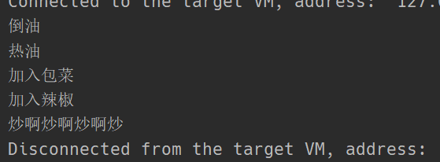

# 模板方法模式

## 1. 概述
模板方法模式定义一个操作中的算法骨架，而将算法的一些步骤延迟到子类中，使得子类可以不改变该算法给够的情况下重定义该算法的某些特定步骤。

## 2. 结构
模板方法（Template Method）模式包含以下主要角色：
- 抽象类（Abstract Class）：负责给出一个算法的轮廓和骨架。它由一个模板方法和若干个基本方法构成。
  - 模板方法：定义了算法的骨架，按某种顺序调用其包含的基本方法。
  - 基本方法：是实现算法各个步骤的方法，是模板方法的组成部分。基本方法又可以分为三种：
    - 抽象方法（Abstract Method）：一个抽象方法由抽象类声明、由其具体子类实现。
    - 具体方法（Concrete Method）：一个具体方法由一个抽象类或具体类声明并实现，其子类可以进行覆盖也可以直接继承。
    - 钩子方法（Hook Method）：在抽象类中已经实现，包括用于判断的逻辑方法和需要子类重写的空方法两种。一般钩子方法是用于判断的逻辑方法，这类方法名一般为isXxx，返回值类型为boolean类型。
- 具体子类（Concrete Class）：实现抽象类中所定义的抽象方法和钩子方法，它们是一个顶级逻辑的组成步骤。

## 3. 案例 炒菜
在炒菜的过程中，很多步骤是相同的，比如在倒油、热油、放蔬菜、加酱料、翻炒这几个步骤中，只有放蔬菜和加酱料的实现逻辑是不确定的。所以我们可以在父类中提前将倒油、热油、翻炒这三个步骤先实现了，并且定义模板方法，规定炒菜的顺序（需要使用final修饰，防止被子类重写）。

**抽象炒菜类**
定义模板方法，实现炒菜过程中的公共逻辑
```java
public abstract class FryVegetable {

    public void pourOil() {
        System.out.println("倒油");
    }

    public void heatOil() {
        System.out.println("热油");
    }

    /**
     * 放蔬菜
     */
    public abstract void pourVegetable();

    /**
     * 放酱料
     */
    public abstract void pourSauce();

    public void fry() {
        System.out.println("炒啊炒啊炒啊炒");
    }

    public final void cookProcess() {
        // 模板方法，将炒菜的算法定义好
        this.pourOil();
        this.heatOil();
        this.pourVegetable();
        this.pourSauce();
        this.fry();
    }
}
```

**创建具体炒菜类**
这里创建两个炒菜类，分别为炒包菜和炒菜心
在这两个类中都继承炒菜父类，并且重写放蔬菜和加酱料的逻辑

```java
public class FryBaoCai extends FryVegetable{

    @Override
    public void pourVegetable() {
        System.out.println("加入包菜");
    }

    @Override
    public void pourSauce() {
        System.out.println("加入辣椒");
    }
}
```

```java
public class FryCaiXin extends FryVegetable{

    @Override
    public void pourVegetable() {
        System.out.println("放入菜心");
    }

    @Override
    public void pourSauce() {
        System.out.println("放入蒜蓉");
    }
}
```

**测试**

```java
public class Client {

    public static void main(String[] args) {
        // 炒一份包菜来吃吃看
        FryVegetable fryVegetable = new FryBaoCai();
        fryVegetable.cookProcess();
    }
}
```



## 4. 优缺点

**优点：**
- 提高代码复用性。将相同部分的代码放在抽象的父类中，而将不同的代码放入不同的子类中。
- 实现了反向控制。通过一个父类调用其子类的操作，通过对子类的具体实现扩展不同的行为，实现了反向控制，符合“开闭原则”。

**缺点：**
- 对每个不同的实现都需要定义一个子类，会导致类的个数增加（但不会导致类爆炸），设计更加抽象。
- 父类中的抽象方法由子类实现，子类执行结果会影响父类的结果，这导致一种反向的控制结构，提高了代码的阅读难度。

## 5. 适用场景
- 算法的整体步骤很固定，但其中个别部分容易发生改变的时候，可以使用模板方法模式，将容易变的部分抽象出来，供子类实现。
- 需要通过子类来决定父类算法中某个步骤是否执行，实现子类对父类的反向控制（利用钩子方法）。

