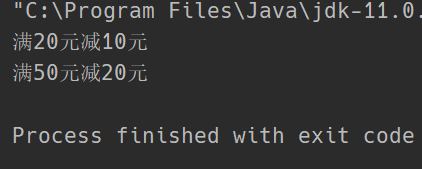

# 策略模式

## 1. 概述
策略模式定义了一系列算法，并将每个算法封装起来，使它们可以相互替换，且算法的变化不会影响使用算法的客户。策略模式属于对象行为模式，它通过对算法进行封装，把使用算法的责任和算法的实现分割开来，并委派给不同的对象对这些算法进行管理。

## 2. 结构
策略模式的主要角色如下：
- 抽象策略（Strategy）类：这是一个抽象角色，通常用一个接口或抽象类实现。此角色给出所有的具体策略类所需的接口。
- 具体策略（Concrete Strategy）类：实现了抽象策略定义的接口，提供具体的算法实现或行为。
- 环境（Context）类：持有一个策略类的引用，最终给客户端调用。

## 3. 案例 促销商品
超市有时为了促销，会推出各种各样的营销活动（策略），然后通过销售员来进行推销，其中销售员的销售流程是不变的，故可以将销售策略聚合到销售员类中。

**抽象策略类**

```java
public interface Strategy {

    /**
     * 使用何种促销活动
     */
    void show();
}
```

**具体策略类**

```java
public class StrategyA implements Strategy{

    @Override
    public void show() {
        System.out.println("满20元减10元");
    }
}
```

```java
public class StrategyB implements Strategy{

    @Override
    public void show() {
        System.out.println("满50元减20元");
    }
}
```

```java
public class StrategyC implements Strategy{

    @Override
    public void show() {
        System.out.println("满1000元任选200元以下商品");
    }
}
```

**销售员类**
将Strategy类型对象聚合进来

```java
public class SalesMan {

    /**
     * 聚合销售策略，具体策略由外界提供
     */
    private Strategy strategy;

    public void setStrategy(Strategy strategy) {
        this.strategy = strategy;
    }

    public void sale() {
        strategy.show();
    }
}
```

**测试**

```java
public static void main(String[] args) {
    // 雇佣一个销售员
    SalesMan man1 = new SalesMan();
    // 将销售策略告诉他，让他去销售
    man1.setStrategy(new StrategyA());
    man1.sale();
    // 再换另一种销售策略
    man1.setStrategy(new StrategyB());
    man1.sale();
}
```



## 4. 优缺点

**优点：**
- 策略类之间可以自由切换。由于策略类都实现同一个接口，所以使它们之间可以自由切换。
- 易于扩展。增加一个新的策略只需要添加一个具体的策略类即可，基本不需要改变原有的代码，符合“开闭原则”
- 避免使用多重条件选择语句（if else），充分体现面向对象设计思想。

**缺点：**
- 客户端必须知道所有的策略类，并自行决定使用哪一个策略类。
- 策略模式将产生很多策略类，可以通过享元模式在一定程度上减少对象的数量。

